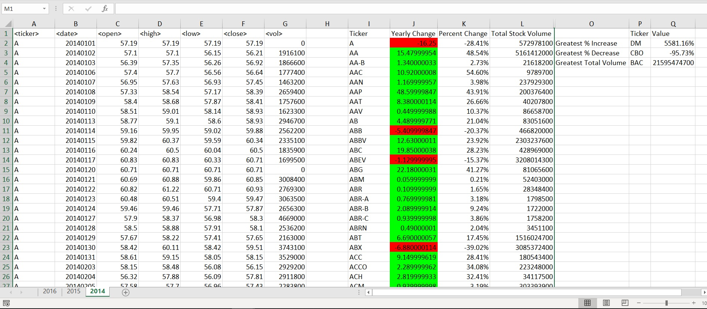
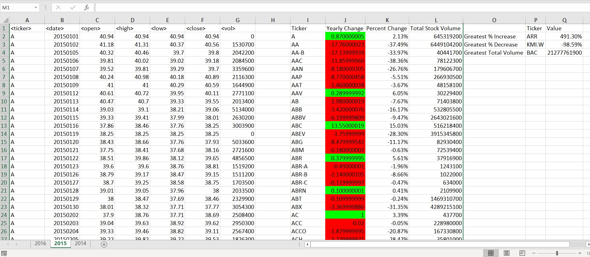
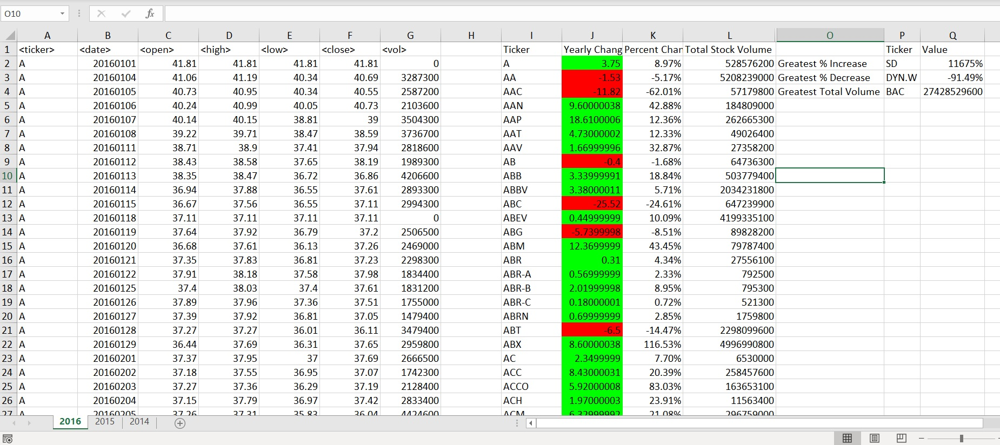

# Stock-Market-VBA-script

## **Objective:**
The objective of this project is to use VBA scripting to analyze stock market data. Using 2014-2016 stock market data, the yearly change, percent change, and total stock volume were calculated for each stock for each year of data. Additionally, the stocks with the greatest % increase, greatest % decrease, and greatest total volume for each year were identified. 

## **Tools:**
Excel VBA

## **Data and Coding:**

Columns A-G represent raw stock market data with over 700,000 rows of data across various stocks. Once the VBA script is ran, columns I-Q appear with data summaries for each stock.

* The script will loop through all the rows to get the following info:

  * Yearly change from what the stock opened the year at to what the closing price was.

  * The percent change from the what it opened the year at to what it closed.

  * The total Volume of the stock

  * Ticker symbol to coincide with the total volume.

* the script also uses coded conditional formatting to highlight positive change in green and negative change in red.

* The script locates the stock with the "Greatest % increase", "Greatest % Decrease" and "Greatest total volume" and prints info along the first four rows of columns O to Q.

* Code is adjusted to allow script to run on every worksheet just by running it once. In this project each worksheet represents a year from 2014-2016. 

